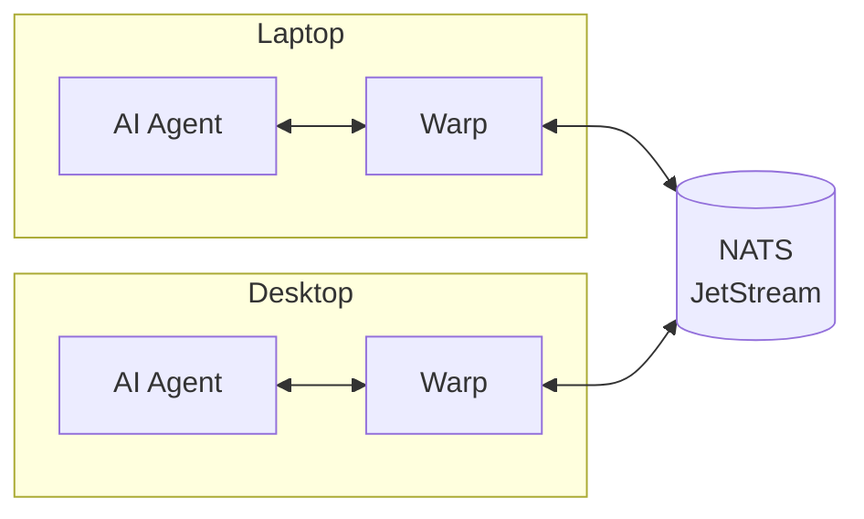
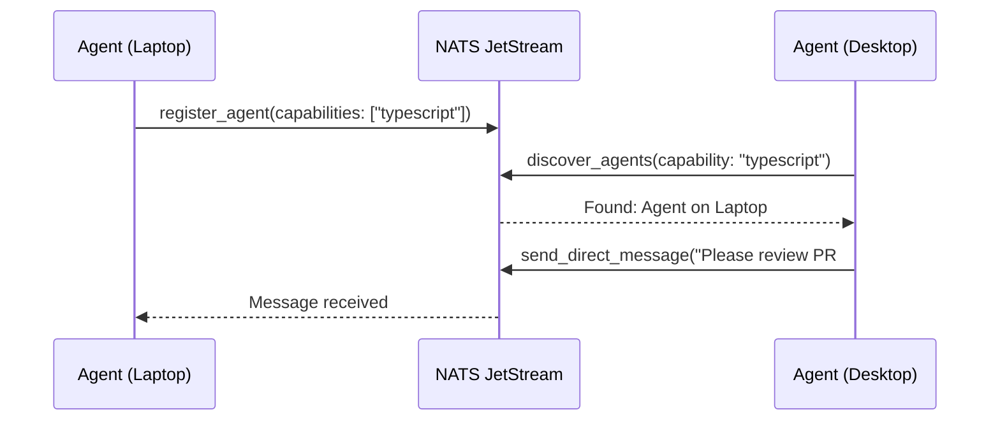
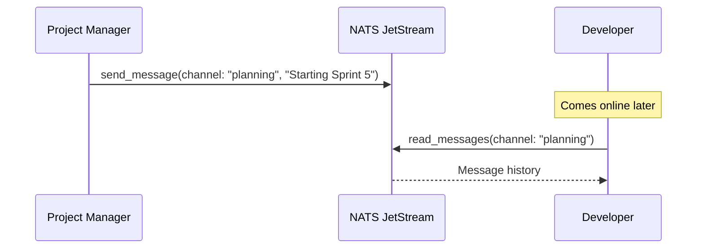

# Loom - Multi-agent infrastructure for AI coordination

> **Beta**: Ready for early adopters. Core features tested and stable. Currently optimized for Claude Code; other MCP-compatible agents planned for v1.

Loom is a framework for building collaborative AI systems. It provides the messaging backbone, orchestration layer, and tooling needed to coordinate multiple AI agents across projects and machines.

## Why Loom?

Instead of one AI agent that tries to do everything, Loom enables you to build a **team of specialists**. Each agent can be configured with domain-specific knowledge and limited to only the tools it needs — a database agent that only touches databases, a frontend agent that only modifies UI code, a security reviewer that can read but not write.

When these specialists can communicate and coordinate, they become more than the sum of their parts. Complex tasks get broken down and routed to the right expert. Work stays within appropriate boundaries. And you maintain control over what each agent can actually do.

**Think of it like building a software team, not a single developer.**

### Agent Agnostic

Loom is designed to work with any AI coding agent that supports the [Model Context Protocol (MCP)](https://modelcontextprotocol.io/). The Warp MCP server provides a standardized interface for agent communication — your agents just need to call the MCP tools to participate in the Loom ecosystem.

## Components

| Component | Description | Repository |
|-----------|-------------|------------|
| **Warp** | MCP server for agent communication (required) | [loom-warp](https://github.com/mdlopresti/loom-warp) |
| **Pattern** | MCP server for agent memory (optional) | [loom-pattern](https://github.com/mdlopresti/loom-pattern) |
| **Weft** | Work coordinator with routing and spin-up (optional) | [loom-weft](https://github.com/mdlopresti/loom-weft) |
| **Shuttle** | CLI for fleet management (optional) | [loom-shuttle](https://github.com/mdlopresti/loom-shuttle) |
| **Tools** | Docker images for CI/CD (optional) | [loom-tools](https://github.com/mdlopresti/loom-tools) |

## Architecture



*Optional components (Pattern, Weft) connect to the same NATS server.*

## Quick Start

### 1. Start NATS with JetStream

```bash
docker run -d --name nats -p 4222:4222 nats:latest -js
```

### 2. Install Warp

```bash
npm install -g @loom/warp
```

### 3. Configure Your MCP Client

Add to your MCP client configuration (e.g., `~/.claude/settings.json` for Claude Code):

```json
{
  "mcpServers": {
    "loom-warp": {
      "command": "warp",
      "env": {
        "NATS_URL": "nats://localhost:4222",
        "LOOM_PROJECT_ID": "my-project"
      }
    }
  }
}
```

That's it! Your agent can now communicate with other agents through Loom.

### Optional Add-ons

| Component | What it adds | Install |
|-----------|--------------|---------|
| **Pattern** | Persistent memory across sessions | `npm install -g @loom/pattern` |
| **Weft** | Work routing, agent spin-up, scaling | `docker run ghcr.io/mdlopresti/loom-weft` |
| **Shuttle** | CLI for fleet management | `npm install -g @loom/shuttle` |

See the [Documentation](#documentation) section for details on each component.

## Features

### Warp (Core)

- **Channels** — Topic-based pub/sub with message persistence
- **Agent Registry** — Cross-computer agent discovery
- **Direct Messaging** — Agent-to-agent communication via personal inboxes
- **Work Queues** — Capability-based work distribution with competing consumers

### Pattern (Optional)

- **Hierarchical Memory** — Private and shared memory scopes
- **Session Context** — Recall relevant memories at startup
- **Cross-Agent Learning** — Share insights across agents

### Weft (Optional)

- **Work Routing** — Route based on capabilities and boundaries
- **Agent Spin-Up** — Launch agents on demand (SSH, Kubernetes, GitHub Actions)
- **Idle Tracking** — Scale down unused agents

### Tools (Optional)

- **Docker Images** — Pre-built containers for CI/CD pipelines
- **Example Workflows** — Ready-to-use GitHub Actions templates

## Use Cases

- **Multi-Machine Development** — Run agents on laptop, desktop, and server, all coordinating through shared NATS
- **Parallel Task Execution** — Break large tasks into subtasks distributed across specialist agents
- **Work Isolation** — Route sensitive work to appropriate machines based on data classification
- **CI/CD Integration** — Spin up agents in GitHub Actions for automated code review, testing, or deployment

## How It Works

### Agent Discovery

Agents register with Warp and discover each other through the shared NATS registry:



### Channel Messaging

Agents communicate through persistent channels. Messages are stored in JetStream, so agents can read history even if they weren't online when messages were sent:



For detailed documentation on work distribution, agent spin-up, and other advanced features, see the [Weft documentation](https://github.com/mdlopresti/loom-weft#readme).

## Documentation

- [Warp Documentation](https://github.com/mdlopresti/loom-warp#readme) - Messaging backbone
- [Weft + Shuttle Documentation](https://github.com/mdlopresti/loom-weft#readme) - Coordinator and CLI
- [Pattern Documentation](https://github.com/mdlopresti/loom-pattern#readme) - Agent memory
- [Tools Documentation](https://github.com/mdlopresti/loom-tools#readme) - Docker images for CI/CD

## Requirements

- Node.js 18+
- NATS Server with JetStream enabled
- Any MCP-compatible AI coding agent

## License

MIT
