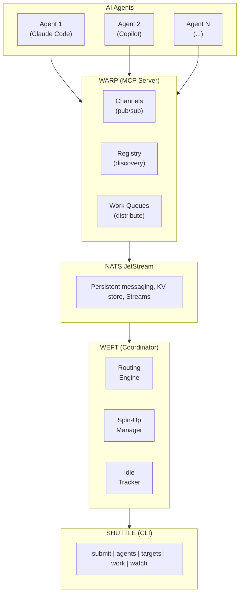
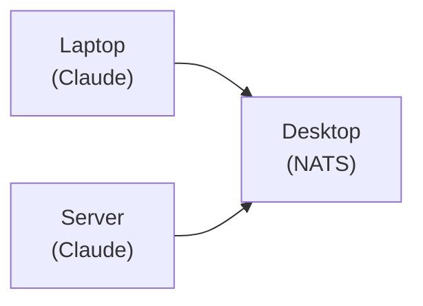
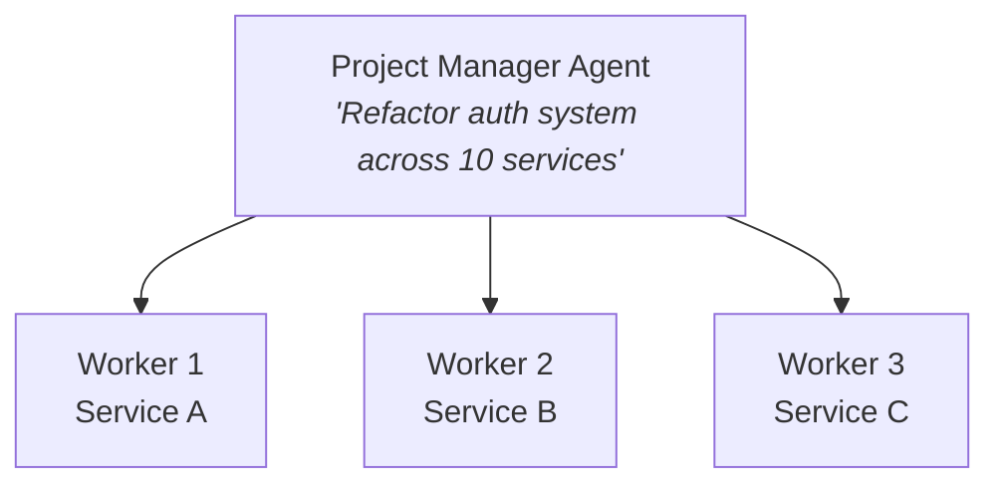

# Loom

**Multi-agent infrastructure for AI coordination.**

[](https://opensource.org/licenses/MIT)

Loom is a framework for building collaborative AI systems. It provides the messaging backbone, orchestration layer, and tooling needed to coordinate multiple AI agents across projects and machines.

> **⚠️ Alpha Software**: This project is under active development and is not yet production-ready. APIs may change without notice, and there may be bugs or missing features. Use at your own risk. Contributions and feedback are welcome!

> **Loom** (noun): A device for weaving thread into fabric. In this project, it weaves AI agents into collaborative systems.

## Components

| Component | Description | Repository |
|-----------|-------------|------------|
| **Warp** | NATS JetStream MCP server for cross-computer agent communication | [loom-warp](https://github.com/mdlopresti/loom-warp) |
| **Weft** | Intelligent work coordinator with capability-based routing | [loom-weft](https://github.com/mdlopresti/loom-weft) |
| **Shuttle** | CLI for fleet management (included in loom-weft) | [loom-weft](https://github.com/mdlopresti/loom-weft) |

## Architecture



## Quick Start

### 1. Start NATS with JetStream

```bash
# Docker (easiest)
docker run -d --name nats -p 4222:4222 nats:latest -js

# Or native
nats-server -js
```

### 2. Install Warp (MCP Server)

```bash
npm install -g @loom/warp
```

Add to your Claude Code MCP configuration (`~/.claude/mcp.json`):

```json
{
  "mcpServers": {
    "loom": {
      "command": "warp",
      "env": {
        "NATS_URL": "nats://localhost:4222"
      }
    }
  }
}
```

### 3. (Optional) Install Weft Coordinator

For advanced features like work routing, agent spin-up, and fleet management:

```bash
# Clone the coordinator
git clone https://github.com/mdlopresti/loom-weft.git
cd loom-weft

# Install and build
pnpm install
pnpm build

# Run the coordinator
pnpm --filter @loom/weft start

# Use the CLI
pnpm --filter @loom/shuttle cli -- agents list
```

## Features

### Warp - Messaging Backbone

- **Channels**: Topic-based pub/sub with message persistence
- **Agent Registry**: Cross-computer agent discovery via shared KV store
- **Direct Messaging**: Reliable agent-to-agent communication
- **Work Queues**: Capability-based work distribution with competing consumers
- **Dead Letter Queue**: Failed work capture for debugging and retry

### Weft - Intelligent Coordinator

- **Routing Engine**: Route work based on capabilities and user-defined boundaries
- **Spin-Up Manager**: Automatically launch agents when work arrives (SSH, local, webhook, Kubernetes, GitHub Actions)
- **Idle Tracking**: Scale down agents that have been idle too long
- **Target Registry**: Manage pre-configured agent launch targets
- **REST API**: Programmatic fleet management

### Shuttle - Fleet Management CLI

```bash
# Submit work
shuttle submit "Implement feature X" --capability typescript --boundary production

# List agents
shuttle agents list

# Manage targets
shuttle targets add --name my-laptop --type claude-code --mechanism ssh --host laptop.local

# Watch activity
shuttle watch
```

## Use Cases

### Multi-Machine Development

Run Claude Code on multiple machines, all coordinating through a shared NATS server:



### Parallel Task Execution

Break large tasks into subtasks and distribute across available agents:



### Work Isolation

Use boundaries to ensure sensitive work stays on appropriate machines:

```bash
# Corporate work routes to corporate-approved machines
shuttle submit "Update API keys" --boundary corporate --capability devops

# Personal projects route to personal machines
shuttle submit "Update blog" --boundary personal --capability writing
```

## Documentation

- [Warp Documentation](https://github.com/mdlopresti/loom-warp#readme)
- [Weft + Shuttle Documentation](https://github.com/mdlopresti/loom-weft#readme)

## Requirements

- Node.js 18+
- NATS Server with JetStream enabled
- Claude Code (for AI agent functionality)

## License

MIT
