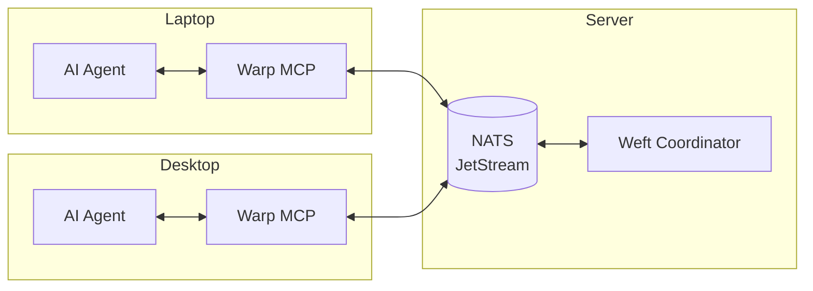

# Loom - Multi-agent infrastructure for AI coordination

> **⚠️ Alpha Software**: This project is under active development and is not yet production-ready. APIs may change without notice, and there may be bugs or missing features. Use at your own risk. Contributions and feedback are welcome!
>
> We are currently building and testing with Claude Code. After v1, we plan to verify and document support for other popular MCP-compatible coding agents.

Loom is a framework for building collaborative AI systems. It provides the messaging backbone, orchestration layer, and tooling needed to coordinate multiple AI agents across projects and machines.

## Why Loom?

Instead of one AI agent that tries to do everything, Loom enables you to build a **team of specialists**. Each agent can be configured with domain-specific knowledge and limited to only the tools it needs — a database agent that only touches databases, a frontend agent that only modifies UI code, a security reviewer that can read but not write.

When these specialists can communicate and coordinate, they become more than the sum of their parts. Complex tasks get broken down and routed to the right expert. Work stays within appropriate boundaries. And you maintain control over what each agent can actually do.

**Think of it like building a software team, not a single developer.**

### Agent Agnostic

Loom is designed to work with any AI coding agent that supports the [Model Context Protocol (MCP)](https://modelcontextprotocol.io/). The Warp MCP server provides a standardized interface for agent communication — your agents just need to call the MCP tools to participate in the Loom ecosystem.

## Components

| Component | Description | Repository |
|-----------|-------------|------------|
| **Warp** | NATS JetStream MCP server for cross-computer agent communication | [loom-warp](https://github.com/mdlopresti/loom-warp) |
| **Weft** | Intelligent work coordinator with capability-based routing | [loom-weft](https://github.com/mdlopresti/loom-weft) |
| **Shuttle** | CLI for fleet management (included in loom-weft) | [loom-weft](https://github.com/mdlopresti/loom-weft) |

## Architecture



## Quick Start

### 1. Start NATS with JetStream

```bash
# Docker (easiest)
docker run -d --name nats -p 4222:4222 nats:latest -js

# Or native
nats-server -js
```

### 2. Install Warp (MCP Server)

```bash
npm install -g @loom/warp
```

Add to your MCP client configuration (example for a typical MCP config file):

```json
{
  "mcpServers": {
    "loom": {
      "command": "warp",
      "env": {
        "NATS_URL": "nats://localhost:4222"
      }
    }
  }
}
```

### 3. (Optional) Install Weft Coordinator

For advanced features like work routing, agent spin-up, and fleet management:

```bash
# Clone the coordinator
git clone https://github.com/mdlopresti/loom-weft.git
cd loom-weft

# Install and build
pnpm install
pnpm build

# Run the coordinator
pnpm --filter @loom/weft start

# Use the CLI
pnpm --filter @loom/shuttle cli -- agents list
```

## Features

### Warp - Messaging Backbone

- **Channels**: Topic-based pub/sub with message persistence
- **Agent Registry**: Cross-computer agent discovery via shared KV store
- **Direct Messaging**: Reliable agent-to-agent communication
- **Work Queues**: Capability-based work distribution with competing consumers
- **Dead Letter Queue**: Failed work capture for debugging and retry

### Weft - Intelligent Coordinator

- **Routing Engine**: Route work based on capabilities and user-defined boundaries
- **Spin-Up Manager**: Automatically launch agents when work arrives (SSH, local, webhook, Kubernetes, GitHub Actions)
- **Idle Tracking**: Scale down agents that have been idle too long
- **Target Registry**: Manage pre-configured agent launch targets
- **REST API**: Programmatic fleet management

### Shuttle - Fleet Management CLI

```bash
# Submit work
shuttle submit "Implement feature X" --capability typescript --boundary production

# List agents
shuttle agents list

# Manage targets
shuttle targets add --name my-laptop --type mcp-agent --mechanism ssh --host laptop.local

# Watch activity
shuttle watch
```

## Use Cases

### Multi-Machine Development

Run AI agents on multiple machines, all coordinating through a shared NATS server:


### Parallel Task Execution

Break large tasks into subtasks and distribute across available agents:


### Work Isolation

Use boundaries to ensure sensitive work stays on appropriate machines:

```bash
# Corporate work routes to corporate-approved machines
shuttle submit "Update API keys" --boundary corporate --capability devops

# Personal projects route to personal machines
shuttle submit "Update blog" --boundary personal --capability writing
```

## How It Works

### Agent Registration & Discovery

When an AI agent starts with Warp MCP configured, it can register itself in the shared registry. Other agents discover it and can send direct messages or work.


### Channel Messaging

Agents communicate through persistent channels. Messages are stored in NATS JetStream, so agents can read history even if they weren't online when messages were sent.


### Work Distribution

Work is published to capability-based queues. The Weft coordinator routes work to appropriate agents based on capabilities and boundaries. If no agent is available, Weft can spin one up.


### Agent Spin-Up

When work arrives but no suitable agent is online, Weft can automatically launch one using pre-configured targets (SSH, local process, webhook, Kubernetes, or GitHub Actions).


### Direct Messaging

Agents can send messages directly to each other via personal inboxes, useful for code review requests, status updates, or task delegation.


## Documentation

- [Warp Documentation](https://github.com/mdlopresti/loom-warp#readme)
- [Weft + Shuttle Documentation](https://github.com/mdlopresti/loom-weft#readme)

## Requirements

- Node.js 18+
- NATS Server with JetStream enabled
- Any MCP-compatible AI coding agent

## License

MIT
